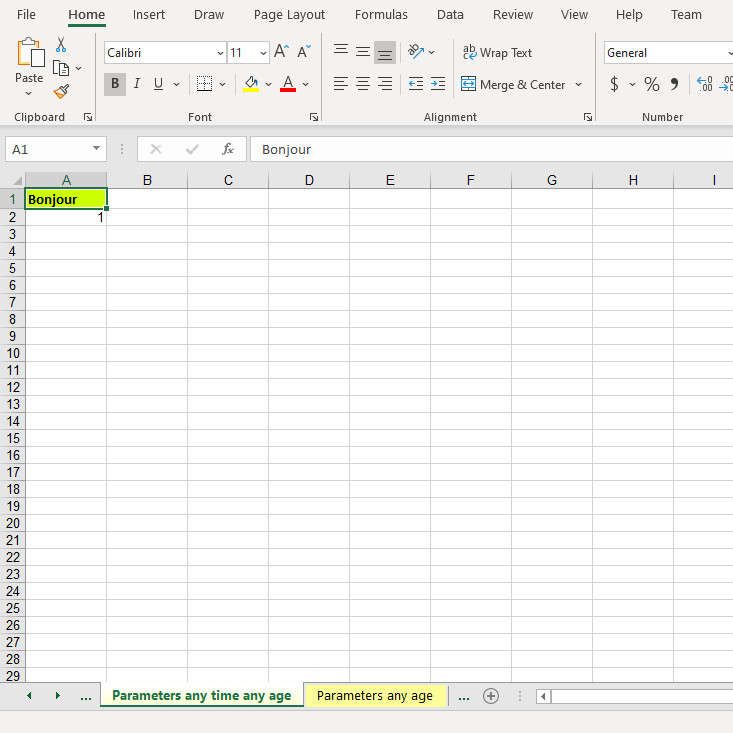
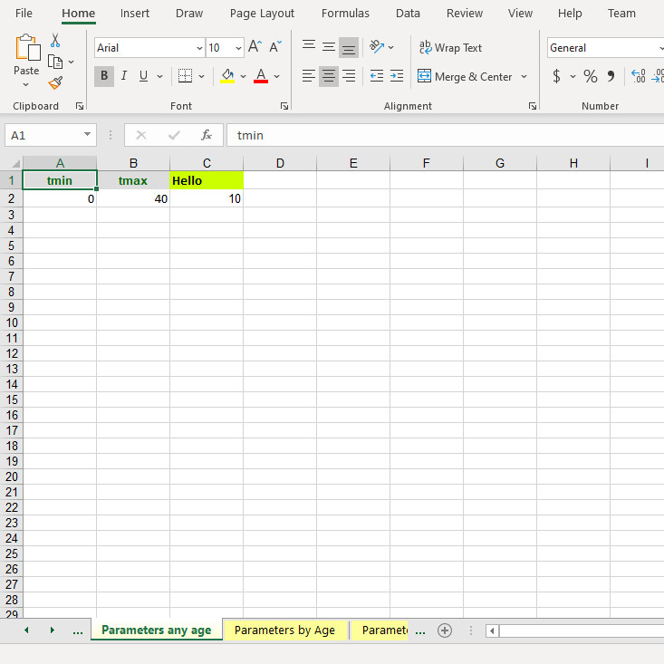
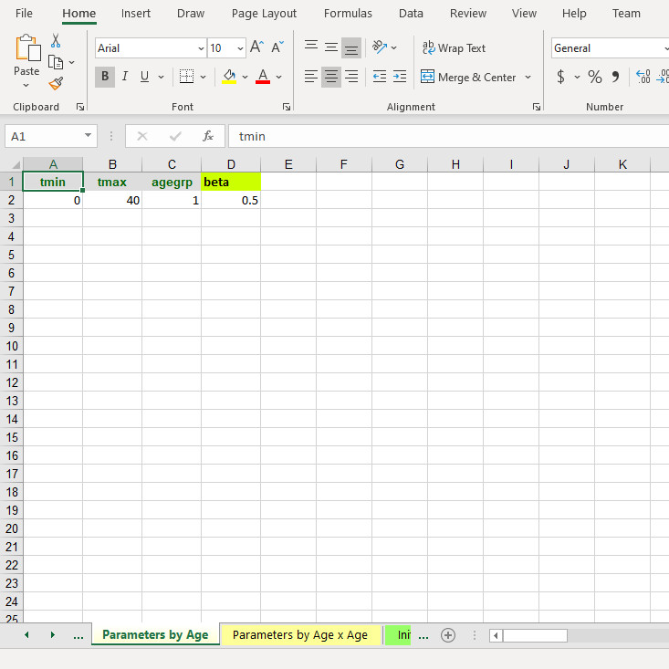
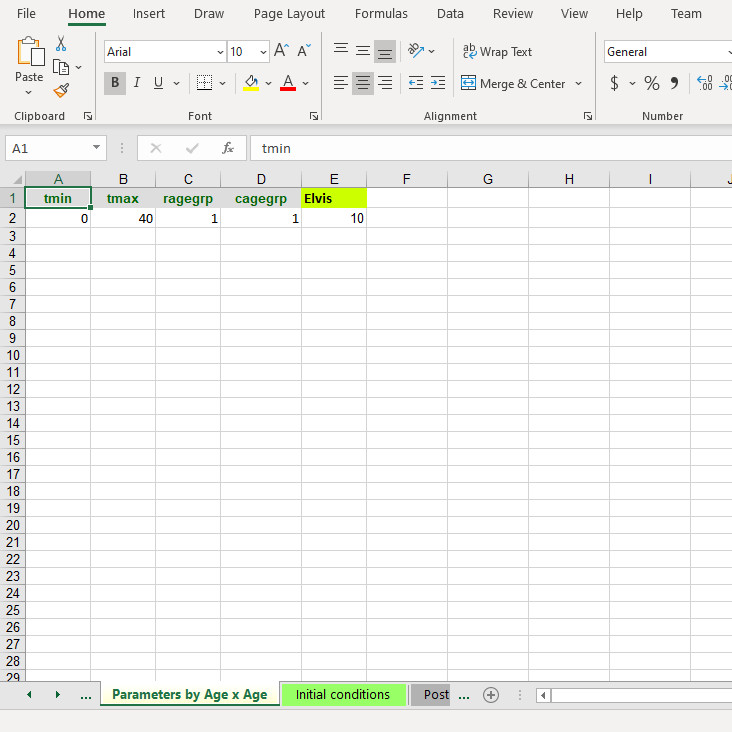
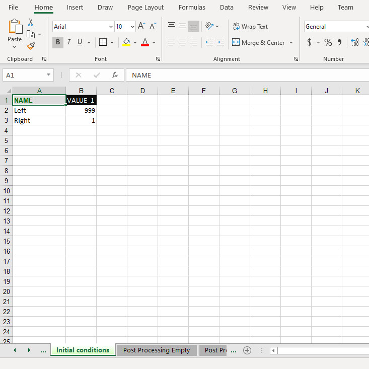
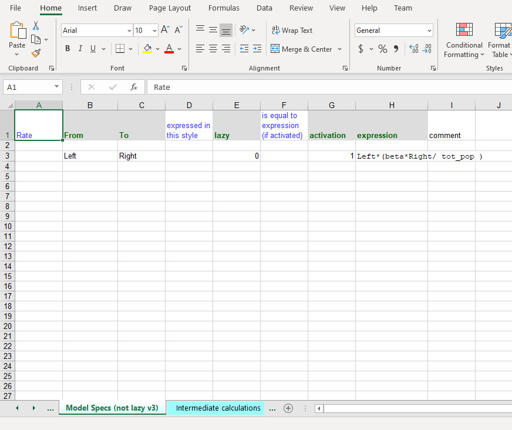
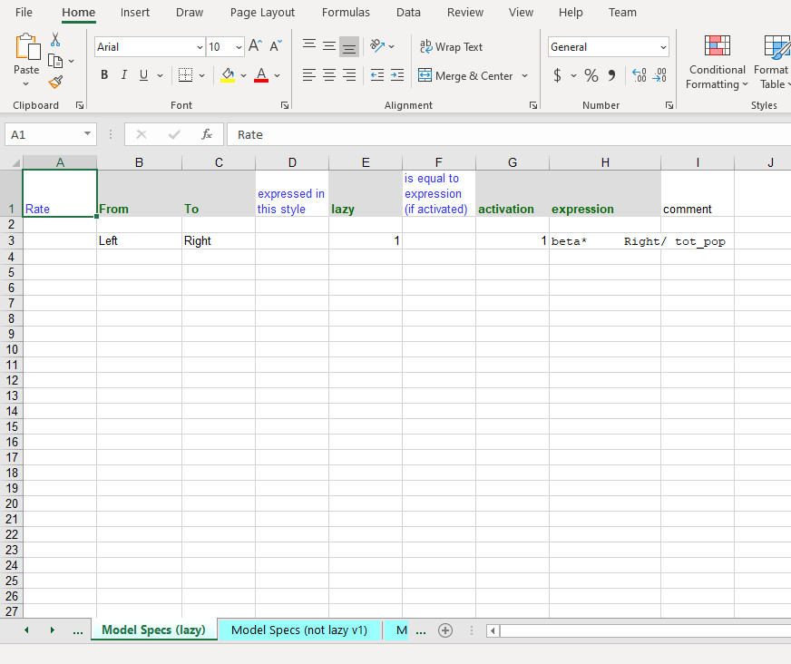
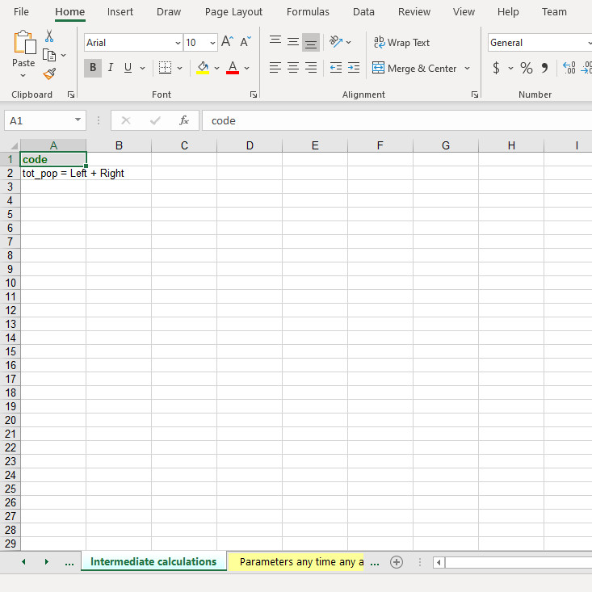
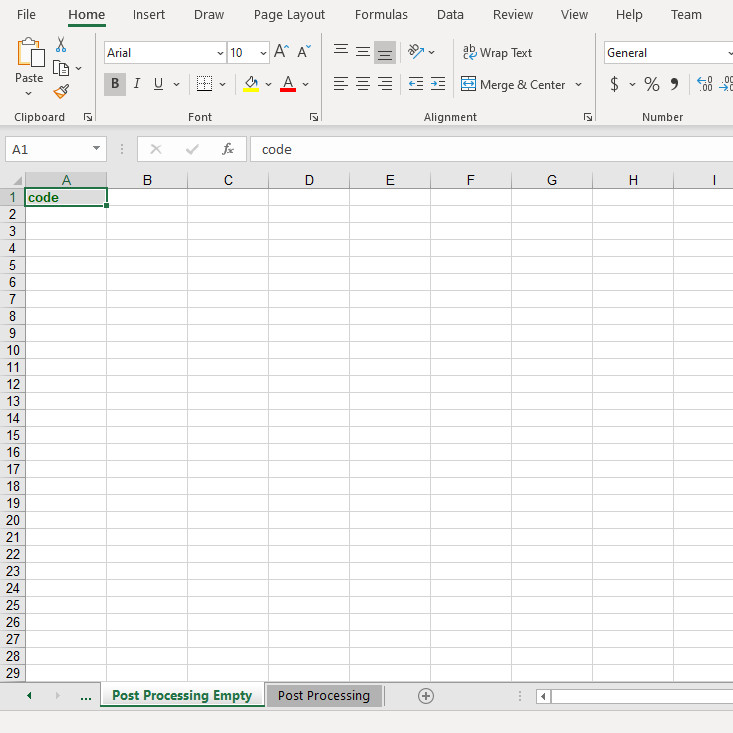
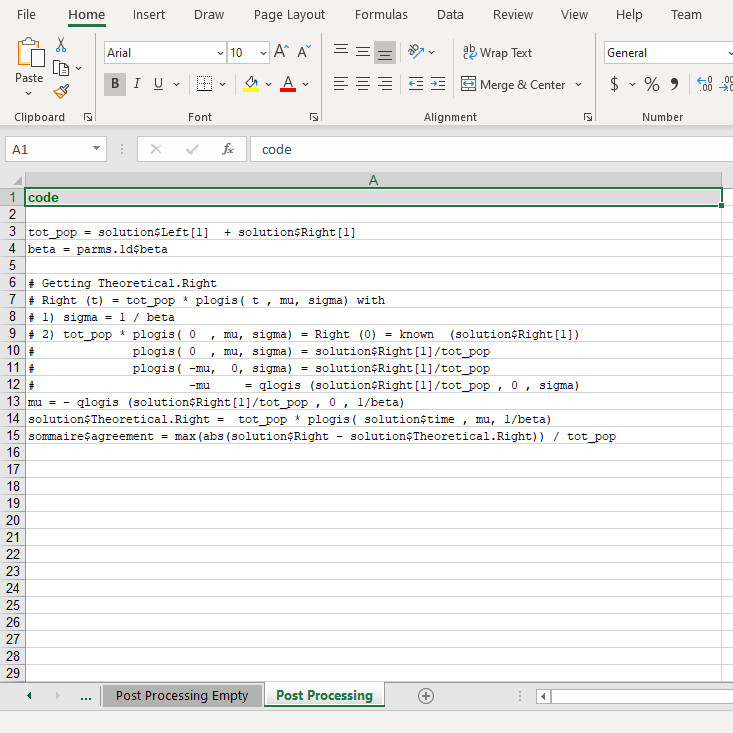

<style>
  img { width: 100%; height: auto; }
  p { margin-top: 1rem;line-height: 1.5rem; }
</style>


```{r setup, include = FALSE}
knitr::opts_chunk$set(
  collapse = TRUE,
  comment = "#>"
)
```

```{r klippy, echo=FALSE, include=TRUE}
klippy::klippy(position = c("top", "right"))
```

## Introduction

This R package enables users to build box/compartment models via an Excel workbook. ODE (ordinary differential equation) or CTMC (continuous-time Markov chain) models can be built Multiple age group models can be built using ODE. This package also provides tools for users to perform sensitivity analsyes/parameter sweeps on their models and to visualize model results.

## Installation
### GitHub

The most recent version of `no.name` is available on GitHub: <a href="https://github.com/barnzilla/no.name" target="_blank">www.github.com/barnzilla/no.name</a>. The `devtools` package allows users to download and install `no.name` directly from GitHub.

```{r warning = FALSE, message = FALSE, eval = FALSE}
devtools::install_github("barnzilla/no.name", upgrade = "never")
library(no.name)
```

### Source package

Users can also download and install the source package using the `install.packages` function from the `utils` package, which comes pre-installed with R.

```{r warning = FALSE, message = FALSE, eval = FALSE}
utils::install.packages(
  pkgs = "https://github.com/barnzilla/r-package-sources/raw/master/no.name_12.03.tar.gz",
  repos = NULL, 
  type = "source"
)
library(no.name)
```

```{r warning = FALSE, message = FALSE, echo = FALSE}
library(no.name)
```

<a name="excel-workbook"></a>

## Demo 1: two-compartment model (left and right)
### Introduction

Users can load a demo Excel workbook that comes with `no.name` using the `get.path` function. This function maps the full path to the location of the Excel workbook on the user's computer. `no.name` can build a two-compartment model from the contents of this Excel workbook.

```{r}
model.1.workbook <- get.path("demo.model.1.xls")
```

### Model input sheets

There are several sheets in <a href="#excel-workbook">this demo Excel workbook</a>. Here are screenshots of each sheet:

**Parameters any time any age**



**Parameters any age**



**Parameters by age**



**Parameters by age x age**



**Initial conditions**



**Model specs (not lazy v1)**


**Model specs (not lazy v2)**


**Model specs (not lazy v3)**



**Model specs (lazy)**



**Intermediate calculations**



**Post processing empty**



**Post processing**



### The seir.n.age.classes function

Users can build a model based on the contents of <a href="#excel-workbook">this demo Excel workbook</a> by calling the `seir.n.age.classes` function. The first two arguments in the function, `file.name` and `sheets.names`, are required. `file.name` is the full path to <a href="#excel-workbook">the demo Excel workbook</a>, which was defined above using the `get.path` function:

```{r}
model.1.workbook <- get.path("demo.model.1.xls")
```

The `sheet.names` argument requires a list of arguments that correspond to sheet names in <a href="#excel-workbook">the demo Excel workbook</a>. For example:

```{r}
sheet.names <- list(
  parms.notime.0d = "Parameters any time any age",
  parms.0d = "Parameters any age",
  parms.1d = "Parameters by Age",
  parms.2d = "Parameters by Age x Age",
  initial.conditions = "Initial conditions",
  model.flow = "Model Specs (not lazy v1)",
  auxiliary.vars = "Intermediate calculations",
  post.processing = "Post Processing Empty"
)
```

Now the model can be built:

```{r}
results.not.lazy.1 <- seir.n.age.classes(model.1.workbook, sheet.names)
```

The `seir.n.age.classes` function returns an object containing the model results. You can also inspect the model inputs by calling the `input.info` list within the `results.not.lazy.1` object, which may be more convenient than flipping between sheets within <a href="#excel-workbook">the demo Excel workbook</a>:

```{r}
results.not.lazy.1$input.info$model.flow[, c("From", "To", "lazy", "activation", "expression")]

results.not.lazy.1$input.info$auxiliary.vars

results.not.lazy.1$input.info$initial.conditions

results.not.lazy.1$input.info$parms.notime.0d

results.not.lazy.1$input.info$parms.0d

results.not.lazy.1$input.info$parms.1d

results.not.lazy.1$input.info$parms.2d

results.not.lazy.1$input.info$post.processing
```

### Non-lazy and lazy styles

There are four different style options available in <a href="#excel-workbook">the demo Excel workbook</a> that can be used when building a model: 

+ "Model Specs (not lazy v1)"
+ "Model Specs (not lazy v2)"
+ "Model Specs (not lazy v3)" 
+ "Model Specs (lazy)"

Building models using one of the other three options simply requires changing the `model.flow` argument in the `sheet.names` list and then calling the `seir.n.age.classes` function again:

```{r}
# Lazy model
sheet.names$model.flow <- "Model Specs (lazy)"
results.lazy <- seir.n.age.classes(model.1.workbook, sheet.names)

# Not lazy v2 model
sheet.names$model.flow <- "Model Specs (not lazy v2)"
results.not.lazy.2 <- seir.n.age.classes(model.1.workbook, sheet.names)

# Not lazy v3 model
sheet.names$model.flow <- "Model Specs (not lazy v3)"
results.not.lazy.3 <- seir.n.age.classes(model.1.workbook, sheet.names)
```

### Post processing

Here are several ways to inspect the model results:

```{r}
head(results.not.lazy.1$solution)

get.scatter.plot(
  results.not.lazy.1$solution$time,
  results.not.lazy.1$solution$Left, 
  height = 500, 
  width = 756
)
results.not.lazy.1$sommaire
```

**Note:** the `sommaire` object is empty because the `post.processing` argument within the `sheet.names` list was set to "Post Processing Empty".

Users can build a model with post processing by setting the `post.processing` argument within the `sheet.names` list to "Post Processing".

```{r}
sheet.names$model.flow <- "Model Specs (lazy)"
sheet.names$post.processing <- "Post Processing"
results.lazy <- seir.n.age.classes(model.1.workbook, sheet.names)
```

Similar to the `results.not.lazy.1` model, the results from this model can be inspected in several ways. The following line displays the code used for post processing:

```{r}
cat(paste(results.lazy$input.info$post.processing$code, collapse = "\n"))
```

Now, when the `sommarie` object is called, it is no longer empty:

```{r}
results.lazy$sommaire
```

When the model solution is called, there is additional content, i.e., a `Theoretical.Right` vector, that is not available in the `results.not.lazy.1` model.

```{r}
head(results.lazy$solution) 
```

### Numerical differences from mathematically equivalment formulations

Users can compare the `results.not.lazy.1` and `results.lazy` models to determine whether the results lead to the same numerical answer:

```{r}
range(results.not.lazy.1$solution - results.lazy$solution[,-4])
```

The model results lead to the same numerical answer, but with rounding errors.

When the `results.not.lazy.2` and `results.lazy` models are compared, they also lead to the same numerical answer, but with rounding errors.

```{r}
range(results.not.lazy.2$solution - results.lazy$solution[,-4])
```

When the results from models `results.not.lazy.3` and `results.lazy` are compared, the numerical answer is identical.

```{r}
range(results.not.lazy.3$solution - results.lazy$solution[,-4])
```
